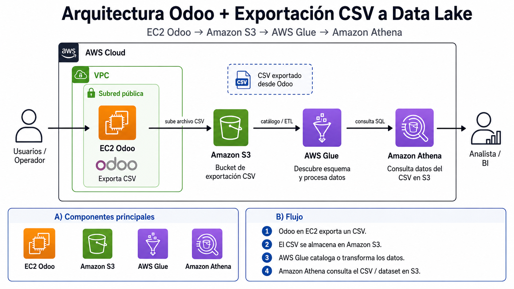

## CSV

¿Qué aspecto tiene el CSV?

```
order_id,date_order,customer_name,country,product_category,product_name,quantity,unit_price,total_amount,status
SO0842,2025-01-01 00:00:00,Comercial Sur,Chile,Hardware,Servidor Dell PowerEdge,14,1382.45,19354.3,Sale
SO0311,2025-01-02 00:00:00,Tech Solutions,España,Servicios Cloud,Migración de Servidores,3,845.2,2535.6,Sale
SO0991,2025-01-02 00:00:00,Industrias XYZ,México,Consultoría,Diseño de Arquitectura,8,150.75,1206.0,Cancelled
SO0105,2025-01-04 00:00:00,Empresa Alfa,Perú,Licencias Software,Odoo Enterprise (50 Users),1,950.0,950.0,Sale
SO0450,2025-01-05 00:00:00,Consultoría Global,Colombia,Soporte Técnico,Bolsa de 50h,2,600.0,1200.0,Draft
... (hasta 1000 registros)
```

## Glue - Athena
Al tener columnas como country y product_category, cuando AWS Glue lo rastree (con un Crawler), creará automáticamente una tabla en el Data Catalog. Luego, con Amazon Athena, tus alumnos podrán lanzar consultas SQL reales como SELECT country, SUM(total_amount) FROM ventas_odoo GROUP BY country; sin necesidad de tener un motor de base de datos encendido.

## Steps
Fase 1: Amazon S3 (Subir tu archivo al Data Lake)

Vamos a crear el "disco duro infinito" donde vivirán tus datos históricos.

    Ve a la consola de AWS y abre S3.

    Haz clic en Crear bucket.

    Ponle un nombre único, por ejemplo: datalake-odoo-ventas-tuapellido.

        Asegúrate de dejar marcada la opción "Bloquear todo el acceso público". ¡Son datos de ventas reales!

    Entra en el bucket y crea una Carpeta llamada ventas_crm.

        💡 Regla de oro del Data Lake: Si mañana descargas los datos de "Facturas" o "Empleados", irán en carpetas distintas. Athena asume que todo lo que hay dentro de una carpeta tiene las mismas columnas.

    Entra en la carpeta ventas_crm y haz clic en Cargar para subir tu archivo ventas_odoo_export.csv.

Fase 2: AWS Glue (Descubrir las columnas del CSV)

Tu archivo CSV tiene columnas específicas (como date_order, amount_total, partner_id, etc.). AWS Glue va a leer el archivo y a crear una tabla para nosotros automáticamente.

    Abre la consola de AWS Glue.

    En el menú izquierdo, ve a Databases y haz clic en Add database. Llámala odoo_analytics y créala.

    En el menú izquierdo, ve a Crawlers (Rastreadores) y haz clic en Create crawler.

    Name: Ponle rastreador-ventas-crm y dale a Next.

    Choose data sources: Haz clic en Add a data source. Selecciona S3 y dale a Browse. Selecciona la carpeta ventas_crm (no selecciones el archivo CSV directamente, selecciona la carpeta que lo contiene). Dale a Add y luego a Next.

    IAM Role: Haz clic en Create new IAM role. AWS le pondrá un nombre por defecto (ej. AWSGlueServiceRole-ventas). Esto le da la llave para leer tu S3. Dale a Next.

    Output configuration: En Target database, selecciona odoo_analytics.

    Revisa todo, dale a Create crawler y, cuando vuelva a la pantalla principal, selecciónalo y pulsa Run crawler.

        Espera 1 o 2 minutos. Cuando el "Status" vuelva a "Ready", te dirá que ha creado 1 tabla nueva.

Fase 3: Amazon Athena (Configurar el motor SQL Serverless)

¡Vamos a lanzar consultas! Pero antes, hay que evitar la trampa clásica de Athena.

    Abre la consola de Amazon Athena.

    🚨 Paso Obligatorio: Athena necesita un lugar temporal para guardar los resultados de las consultas.

        Ve a la pestaña Settings (Configuración) > Manage.

        En Query result location, escribe la ruta a tu bucket con una carpeta nueva. Por ejemplo: s3://datalake-odoo-ventas-tuapellido/resultados-athena/ y guárdalo.

    Vuelve a la pestaña Editor.

    A la izquierda, en el desplegable de Database, selecciona odoo_analytics.

    Verás que aparece tu tabla (se llamará ventas_crm). Haz clic en los tres puntitos a su derecha y selecciona Preview Table.

        ¡Magia! Verás los datos de tu CSV de Odoo en formato tabla de base de datos.

Fase 4: Analítica de Negocio (El Reporte Directivo)

Ahora que los datos están listos, vamos a responder a las preguntas de negocio.

Nota: AWS Glue lee las cabeceras de tu CSV. En mis ejemplos uso los nombres de columna estándar de Odoo (como amount_total o date_order). Si en tu CSV se llaman en español o diferente (ej. total, fecha_pedido), simplemente cambia el nombre en el código SQL.

Borra el código que haya en el Editor de Athena y prueba estas consultas de Nivel Experto:

SQL
1. Ver una muestra de los datos
 ```
SELECT *
FROM "odoo_analytics"."e_odoo_ventas_2026"
LIMIT 20;
 ```
3. Resumen general de ventas
 ```
SELECT
    COUNT(*) AS num_lineas,
    COUNT(DISTINCT order_id) AS num_pedidos,
    MIN(TRY_CAST(date_order AS timestamp)) AS primera_fecha,
    MAX(TRY_CAST(date_order AS timestamp)) AS ultima_fecha,
    SUM(quantity) AS unidades_totales,
    ROUND(SUM(total_amount), 2) AS importe_total,
    ROUND(AVG(total_amount), 2) AS importe_medio_linea
FROM "odoo_analytics"."e_odoo_ventas_2026";
 ```
5. Ventas por estado del pedido
 ```
SELECT
    status,
    COUNT(*) AS num_lineas,
    COUNT(DISTINCT order_id) AS num_pedidos,
    SUM(quantity) AS unidades,
    ROUND(SUM(total_amount), 2) AS importe_total
FROM "odoo_analytics"."e_odoo_ventas_2026"
GROUP BY status
ORDER BY importe_total DESC;
 ```
6. Ventas mensuales
 ```
SELECT
    DATE_FORMAT(
        DATE_TRUNC('month', TRY_CAST(date_order AS timestamp)),
        '%Y-%m'
    ) AS mes,
    COUNT(DISTINCT order_id) AS num_pedidos,
    SUM(quantity) AS unidades,
    ROUND(SUM(total_amount), 2) AS importe_total
FROM "odoo_analytics"."e_odoo_ventas_2026"
WHERE TRY_CAST(date_order AS timestamp) IS NOT NULL
GROUP BY 1
ORDER BY 1;
 ```
7. Top 10 clientes por importe vendido
 ```
SELECT
    customer_name,
    country,
    COUNT(DISTINCT order_id) AS num_pedidos,
    SUM(quantity) AS unidades,
    ROUND(SUM(total_amount), 2) AS importe_total
FROM "odoo_analytics"."e_odoo_ventas_2026"
GROUP BY customer_name, country
ORDER BY importe_total DESC
LIMIT 10;
 ```
Extra útil: ventas por producto y categoría
 ```
SELECT
    product_category,
    product_name,
    COUNT(DISTINCT order_id) AS num_pedidos,
    SUM(quantity) AS unidades_vendidas,
    ROUND(AVG(unit_price), 2) AS precio_medio,
    ROUND(SUM(total_amount), 2) AS importe_total
FROM "odoo_analytics"."e_odoo_ventas_2026"
GROUP BY product_category, product_name
ORDER BY importe_total DESC;
 ```
La reflexión final

Cuando le des al botón de Run y veas que el resultado aparece en apenas 1 o 2 segundos, recuerda el concepto core del Módulo 6: Hemos hecho una agrupación matemática pesada sobre un histórico de ventas, y Odoo no se ha enterado en absoluto. Tu base de datos transaccional (RDS) sigue libre y rápida, mientras los directivos pueden jugar con los datos usando Athena pagando solo fracciones de céntimo por cada consulta. ¡El aislamiento perfecto!
